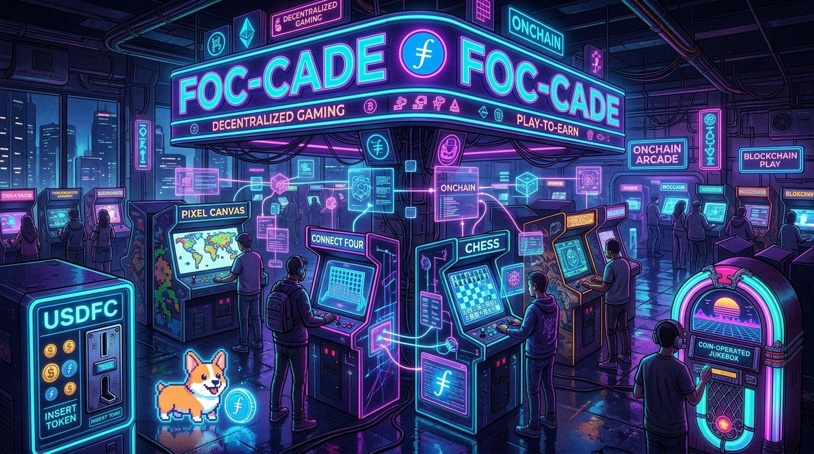

# foc-collab



Serverless multiplayer games and one tamagotchi with Filecoin Onchain
Cloud (FOC) as the only backend. In the games, players append small
signed JSON pieces to data sets from the browser and every client derives
identical state by folding the piece log; the corgi folds the deposit
history of a Filecoin Pay account. No server, no database, no
coordination service.

Play: https://sgtpooki.github.io/foc-collab/ (GitHub Pages, deployed from
`main` by `.github/workflows/pages.yml`).

Origin: [Notion, viewer saves for published artifacts](https://app.notion.com/p/filecoindev/Idea-viewer-saves-for-published-artifacts-session-key-writes-to-FOC-3cddc41950c1819fb40eeb2cbe14263a).

## What's here

- `games/tic-tac-toe/` and `games/connect-four/`: two bring-your-own-wallet
  games. Each has a pure v1 fold (`fold.js`, seats by signing token, one
  shared log), a thin v2 rules module (`fold-byow.js`), a computer opponent
  (`cpu.js`), and a page that is markup plus one `mountGame` call.
- `games/chat/`, `games/paint/`, `games/jukebox/`: many-writer apps.
  Chat rooms (a lobby and one per game) where anyone may post, a 64 by 64
  paint canvas, and a coin-operated jukebox. Guests write through the
  arcade's sponsored data sets and their authorizer contracts, no wallet
  needed; a jukebox coin is a USDFC deposit from a wallet.
- `games/lib/`: everything the apps share. `byow-engine.js` is the v2
  fold engine (seat-owner sequencing across per-player data sets),
  `boot-byow.js`, `play-byow.js`, `room-byow.js`, and `dashboard-byow.js`
  the page shells, `identity.js` P-256 signing, `wallet-sig.js` wallet
  signatures over pieces, `wallet-byow.js` in-page wallet onboarding,
  `coins.js` Filecoin Pay deposits, `discover.js` chain-event discovery,
  `transport-byow.js` keyless reads, session-key writes, and sponsored
  guest writes.
- `apps/corgi/`: the FOC corgi. Its life is the runway of a Filecoin Pay
  payer account; feeding is depositing straight into that account from
  your wallet (no data set, no session key); a deposit at or above the
  page's adoption threshold (1 USDFC in `config.calibration.json`) adopts
  a corgi into the park.
- `contracts/authorizer/`: `ArcadeAuthorizer.sol`, the per-data-set write
  policy the sponsored data sets run (cooldown, budget, size cap,
  blocklist, pause), and the minimal `CooldownAuthorizer.sol` spike.
  Addresses in `site/arcade.json`.
- `site/` and `scripts/build-site.mjs`: the landing page and every app as
  a self-contained page.
- `docs/`: `FEASIBILITY.md` (architecture, security model, what is proven),
  `BYOW-PLAYERS.md` (how to play with your wallet), `IDEAS.md`.
- `research/`: dated investigations and peer-review rounds.
- `scripts/`: wallet setup, page and site builds, chain spikes.

## Bring your own wallet

There is no shared log on the site. Each player has a wallet, pays for
their own writes, and appends only to their own data set. Both pages read
both data sets keylessly and fold them with the schema v2 rules in
`games/lib/byow-engine.js`: a game is (game id, root data set), the
creator's first move seats the first joiner and names the joiner's data
set, and the only order the fold trusts is piece id inside one data set.
A seat belongs to a data set, so the same wallet in another browser is
the same player. Opponents are found from PieceAdded chain events; the
page carries no key of anyone's.

One data set per wallet serves every game on the site. "Play the
computer" runs a solo game inside that same data set: the computer is a
second signing identity in your browser and its moves cost only their
pieces. The landing page boots the same transport and lists your games
across every app, the ones waiting on you first.

Visitors without a wallet still write: chat posts, paint pixels, and
jukebox picks go into data sets the arcade wallet pays for, through
authorizer contracts that enforce a cooldown, a daily budget, and a
size cap per guest key minted in the browser.

A move settles in about a minute (issue #7 tracks measuring that).

How to play: `docs/BYOW-PLAYERS.md`. Design and threat model:
`research/2026-09-10-byow-proof-plan.md`. Runnable proofs:
`npm run proof:byow` (node, two wallets) and `npm run test:e2e:byow`
(two browser contexts).

## Running a game locally

```bash
node scripts/build-page.mjs dist/local                    # tic-tac-toe
node scripts/build-page.mjs dist/c4 --game connect-four   # or connect four
npx serve dist/local                                      # or dist/c4
```

Open the URL in two tabs. Create a game in one, copy the invite link, open
it in the other and join. With no config the page uses the local
transport (one localStorage log shared through BroadcastChannel, a
per-tab identity) and the v1 shared-log fold, `games/<game>/fold.js`.
The site pages are built with a `{ "mode": "byow" }` config and use the
v2 engine; the page shell, `games/lib/play-byow.js`, is the same in both
builds.

## Setup for the chain-backed scripts

Copy `.env.example` to `.env` and set `PRIVATE_KEY` (gitignored). Runtime
configuration lives in the committed `config.env`; scripts and the publish
skill source both: `set -a; . ./config.env; . ./.env; set +a`. Commands
are listed in `CLAUDE.md`.

## License

Dual-licensed under the [Permissive License Stack](https://web.archive.org/web/20241127162157/https://www.protocol.ai/blog/announcing-the-permissive-license-stack/):
- [Apache License, Version 2.0](LICENSE-APACHE)
- [MIT License](LICENSE-MIT)

