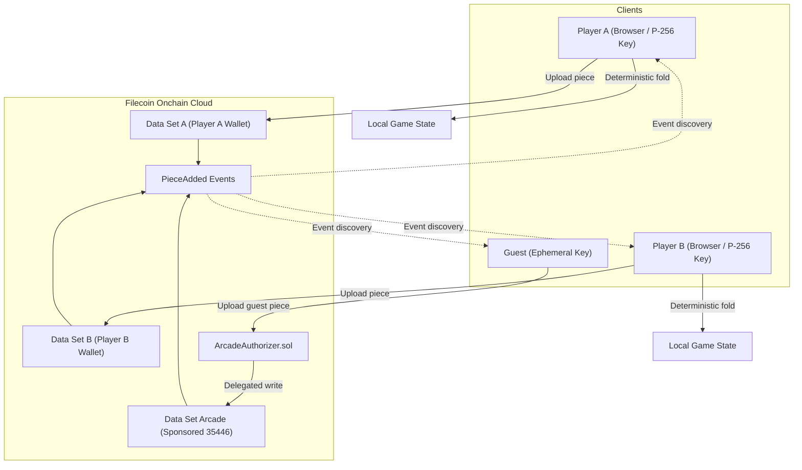

# Architecture

Filecoin Onchain Cloud (FOC) serves as the sole backend for this application suite. Clients run without centralized application servers, databases, or WebSocket coordinators.

## Core pattern: the deterministic fold

Application state is a pure function of an ordered piece log. Every player action (moves, chat messages, pixel updates, jukebox picks) is a signed JSON payload uploaded as a Filecoin storage piece.

Because the Filecoin storage contract assigns monotonic piece IDs, clients evaluate the log locally to derive identical state. Invalid moves, wrong turns, and malformed pieces are rejected by the fold logic.

## Bring your own wallet (BYOW)

Schema v2 assigns each player their own data set paid by their wallet:
- Seats map directly to data sets rather than browser tokens.
- Ordering trusts the monotonic piece ID inside an author's own data set; each move names the previous accepted move by content hash.
- Seat ratification occurs when the game creator's first move references the joiner's join piece and names the joiner's data set.
- Opponent discovery scans `PieceAdded` contract logs directly from RPC nodes.

### Sponsored arcade writes

Guests without wallets write through sponsored data sets:
- `ArcadeAuthorizer.sol` delegates write permissions on behalf of the arcade wallet.
- Contracts enforce four operational constraints: per-key cooldown epochs, maximum pieces per transaction, maximum piece byte height, and windowed write budgets.
- Ephemeral signing keys generated in browser memory authenticate individual guest sessions.

## Application catalog

| Application | Category | Storage model | Access requirements |
| :--- | :--- | :--- | :--- |
| Tic-Tac-Toe | Turn-based game | BYOW data sets | Wallet with calibration funds, or local CPU |
| Connect Four | Turn-based game | BYOW data sets | Wallet with calibration funds, or local CPU |
| Paint War | Shared 64x64 canvas | Sponsored arcade data set | No wallet required; guest writes gated by cooldown |
| Jukebox | Shared audio queue | Till deposits plus sponsored picks | 0.01 USDFC deposit per pick credit |
| Chat | Messaging rooms | Hybrid multi-log | BYOW wallet or sponsored arcade guest |
| FOC Corgi | Storage life pet | Direct Filecoin Pay deposits | Any deposit feeds; the page's adoption threshold (1 USDFC on the site) adopts |

## System constraints and scaling

Turn settlement on Calibration net averages 30 to 60 seconds per piece. The design targets asynchronous and turn-based interactions where transaction latency fits gameplay.

Readers sync each data set incrementally after a first full listing (the highest active piece id is the cursor; a full listing every twelfth poll still catches removals). Planned next: state snapshots, periodic checkpoint pieces so a late reader does not replay the whole log.
